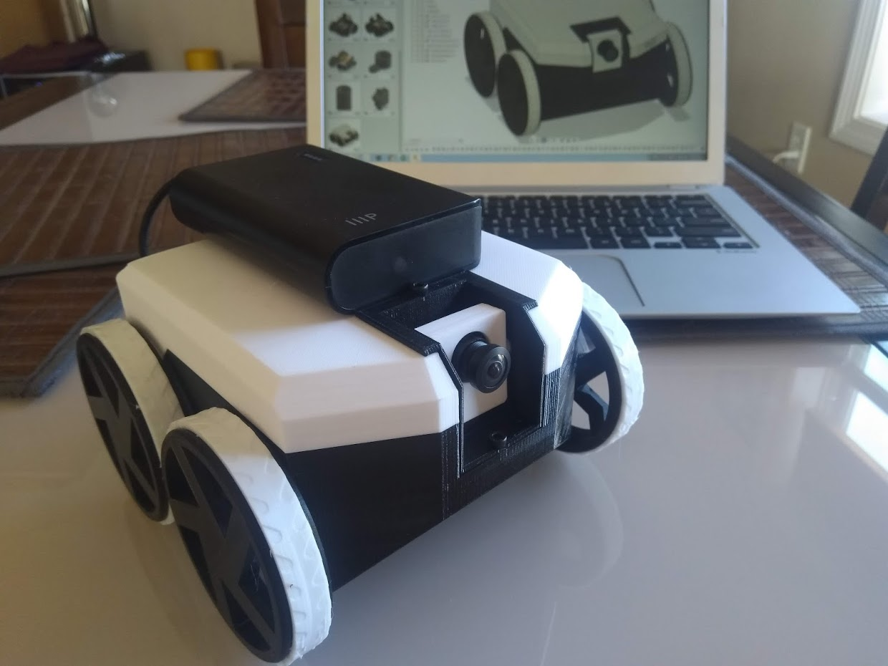

# Allbot

For the robot that had to walk in the maze we used the allbot which was based on an arduino and an application on a mobile phone or tablet. If we wanted to complete the full project we would be using a robot based on a raspberry pi with wheels instead this way the robot would be stronger and it would be easier to connect to the backend. We would also be able to choose if we controlled the robot with an application or with a controller.

You can find anything about the robot that is pictured above with this link [https://github.com/nikivanov/watney](https://github.com/nikivanov/watney)

