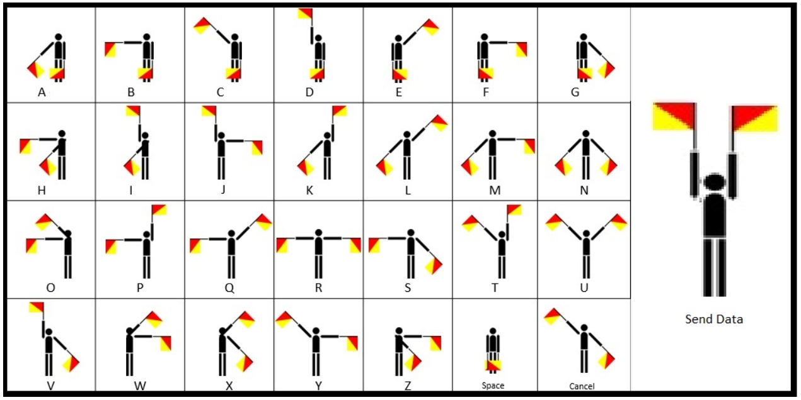
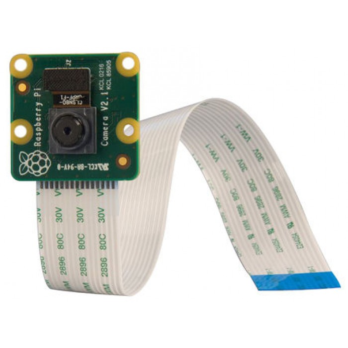

# Allbot

## **Story** 

The user will have to control the Allbot and to make him advance in the maze thanks to the application on his smartphone. The maze is close on the top so the user can not see where is the robot and where to go. So, the user will have a vision of the inside of the maze on a screen thanks to the camera which is placed on the top of the robot.

The Allbot is initially in the centre of the maze and the task of the user is to make him go out of this maze. During his path, the user will see some letters on the walls and he will have to say them to his colleague, who is going to make the exact position corresponding to the letter in front of the Kinect to valid it. When the user will have all the letters and that the other person will have make all the correct positions, the final word is “KIPPIS”.

## About the Allbot  

To make this part of the work, we have used a robot which is named “**Allbot**”. This robot owns four legs with four knees and moves thanks to eight **servomotors**. Each leg can rotate horizontally for around 150° and each knee can rotate vertically for 180°, that means that there are two servomotors for each leg for the two moves. So, the Allbot can walk forward, backward, on the side, … thanks to some combination of rotation of the legs and the knees.

The Allbot is controlled by an application which is available on every **smartphone**, the app is called “ALLBOT”. To control the robot with this app, an IR transmitter is required, it’s an extern module which will send the instruction of the smartphone to the robot. On this app, there are several options of moves like walking forward, backward, on the side or orientate on a side or to make a move with the legs to say “Hello” … There is also a scale to adjust the speed of the moves of the legs. The possibility to produce a sound is also available.

The Allbot owns three cards on it. The first one is the **Arduino** card, the second one is the driver, and the third one is for the battery. Each card is connected with pins on each other. In supplementary, a camera is also connected on the robot to provide to the user to see where he goes.

## **Materials**

### Allbot

#### Features __

* all necessary plastic parts
* 8 x 9G servo motors
* a servo motor connector shield \(VRSSM\)
* a battery shield \(VRBS1\)
* includes different feet
* VR001 infrared transmitter with app for smartphone or tablet \(Android® or iOS®\)
* for a list of tested devices, please refer to: [http://manuals.velleman.eu](http://manuals.velleman.eu/article.php?id=407)
* online manual available here: [http://manuals.velleman.eu](http://manuals.velleman.eu/category.php?id=85)
* operatable with Arduino and other compatible devices \(microcontroller required but not included!\)

#### Specifications : 

* servo motor connector shield \(VRSSM\):
  * compatible with [ARDUINO-UNO-R3: ARDUINO® UNO REV.3 ](https://www.velleman.eu/products/view/?id=416756)and [ARD-A000067: ARDUINO® MEGA2560 REV3 ](https://www.velleman.eu/products/view/?id=418064)\(required but not included\)
  * [ARDUINO-UNO-R3: ARDUINO® UNO REV.3 ](https://www.velleman.eu/products/view/?id=416756)can drive max. 12 servo motors
  * [ARD-A000067: ARDUINO® MEGA2560 REV3 ](https://www.velleman.eu/products/view/?id=418064)can drive max. 36 servo motors
  * IR receiver
  * beeper
  * power indicator LEDs
* battery shield \(VRBS1\):
  * power supply: 12 V booster for Arduino board \(4 x AA batteries, alkaline or NiMH recommended but not incl.\)
  * ON-OFF switch

### ARDUINO® UNO REV.3

The Arduino Uno is a microcontroller board based on the ATmega328. It contains everything needed to support the microcontroller; simply connect it to a computer with a USB cable or power it with a AC-to-DC adapter or battery to get started.  
The Uno differs from all preceding boards in that it does not use the FTDI USB-to-serial driver chip. Instead, it features the Atmega16U programmed as a USB-to-serial converter.

#### **Features**

* digital I/O pins: 14 \(of which 6 provide PWM output\)
* analogue input pins: 6
* contains: 16 MHz ceramic resonator, a USB connection, a power jack, an ICSP header, and a reset button

#### **Specifications**

* power supply: 6-20 V max. \(adapter not included\)
* microcontroller: ATmega328
* digital I/O pins: 14 \(of which 6 provide PWM output\)
* DC current per I/O pin: 40 mA
* DC current for 3.3 V pin: 50 mA
* analogue input pins: 6
* flash memory: 32 kB \(ATmega328\) of which 0.5 kB used by bootloader
* SRAM: 2 kB \(ATmega328\)
* EEPROM: 1 kB \(ATmega328\)
* clock speed: 16 MHz

### ARDUINO® MEGA2560 REV3

The Arduino Mega 2560 is a microcontroller board based on the ATmega2560. It has 54 digital input/output pins \(of which 14 can be used as PWM outputs\), 16 analog inputs, 4 UARTs \(hardware serial ports\), a 16 MHz crystal oscillator, a USB connection, a power jack, an ICSP header, and a reset button. It contains everything needed to support the microcontroller; simply connect it to a computer with a USB cable or power it with a AC-to-DC adapter or battery to get started. The Mega is compatible with most shields designed for the Arduino Uno, Duemilanove or Diecimila.

The Mega 2560 is an update to the Arduino Mega, which it replaces.

Additional features coming with the R3 version are:

* ATmega16U2 instead of 8U2 as USB-to-serial converter
* 1.0 pinout: added SDA and SCL pins for TWI communication placed near to the AREF pin and two other new pins placed near to the RESET pin, the IOREF that allows the shields to adapt to the voltage provided from the board, and the second one is an unconnected pin that is reserved for future purposes.
* stronger RESET circuit.

### ALLBOT® BATTERY SHIELD

#### **Features**

* supplies 5 - 6V \(servos\) and 12V \(ArduinoALLBOT®\)
* possibility to connect to external power supply
* power switch
* spare part

#### **Specifications**

* external power supply: 5 - 6V \(not incl.\)
* Arduino® power supply: 12V - 200mA
* battery power supply: 4 x AA batteries \(not incl.\)

### ALLBOT® OPTION: SMARTPHONE IR TRANSMITTER

#### **Features**

* control your ALLBOT® with an iPhone®, iPad® or Android® device
* plugs into the 3.5 mm audio jack, adjust the volume and fire up the ALLBOT app
* easy installation of the battery \(remove when not in use\)
* uses an easy protocol so you can modify the Arduino sketch and let your ALLBOT do multiple things
* for a list of tested devices, please refer to: [http://manuals.velleman.eu](http://manuals.velleman.eu/article.php?id=407)

#### **Specifications**

* uses a CR2032 battery \(incl.\)
* 3 to 4 m range
* audio to IR
* transmit indication LED

### Raspberry Pi 3B

The **Raspberry Pi** is a series of small [single-board computers](https://en.wikipedia.org/wiki/Single-board_computer) developed in the [United Kingdom](https://en.wikipedia.org/wiki/United_Kingdom) by the [Raspberry Pi Foundation](https://en.wikipedia.org/wiki/Raspberry_Pi_Foundation) to promote teaching of basic [computer science](https://en.wikipedia.org/wiki/Computer_science) in schools and in [developing countries](https://en.wikipedia.org/wiki/Developing_countries).The original model became far more popular than anticipated,[\[8\]](https://en.wikipedia.org/wiki/Raspberry_Pi#cite_note-1000x-8) selling outside its [target market](https://en.wikipedia.org/wiki/Target_market) for uses such as [robotics](https://en.wikipedia.org/wiki/Robotics). It does not include peripherals \(such as [keyboards](https://en.wikipedia.org/wiki/Keyboard_%28computing%29) and [mice](https://en.wikipedia.org/wiki/Mouse_%28computing%29)\) and [cases](https://en.wikipedia.org/wiki/Computer_case). However, some accessories have been included in several official and unofficial bundles.[\[8\]](https://en.wikipedia.org/wiki/Raspberry_Pi#cite_note-1000x-8)

The Raspberry Pi 3 Model B+ is the latest product in the Raspberry Pi 3 range.

* Broadcom BCM2837B0, Cortex-A53 \(ARMv8\) 64-bit SoC @ 1.4GHz
* 1GB LPDDR2 SDRAM
* 2.4GHz and 5GHz IEEE 802.11.b/g/n/ac wireless LAN, Bluetooth 4.2, BLE
* Gigabit Ethernet over USB 2.0 \(maximum throughput 300 Mbps\)
* Extended 40-pin GPIO header
* Full-size HDMI
* 4 USB 2.0 ports
* CSI camera port for connecting a Raspberry Pi camera
* DSI display port for connecting a Raspberry Pi touchscreen display
* 4-pole stereo output and composite video port
* Micro SD port for loading your operating system and storing data
* 5V/2.5A DC power input
* Power-over-Ethernet \(PoE\) support \(requires separate PoE HAT\)

### Raspicam

The Raspberry Pi Camera Module v2 replaced the original Camera Module in April 2016. The v2 Camera Module has a Sony IMX219 8-megapixel sensor \(compared to the 5-megapixel OmniVision OV5647 sensor of the original camera\).

The Camera Module can be used to take high-definition video, as well as stills photographs. It’s easy to use for beginners, but has plenty to offer advanced users if you’re looking to expand your knowledge. There are lots of examples online of people using it for time-lapse, slow-motion, and other video cleverness. You can also use the libraries we bundle with the camera to create effects.

## 

