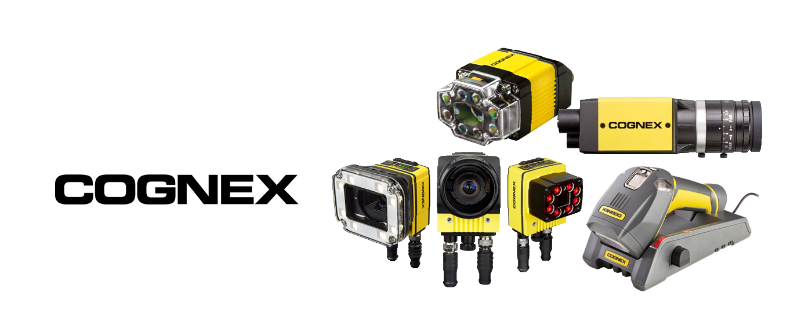

# Image Reader

## Story 

In the room, there several objects which are hidden. The user will have to respond to some question and the answer will indicate him which kind of object he has to search in the room. After he found the correct objects, he has to present them under the camera to be valid. Without the answer of the question, the user doesn’t know which object he has to present under the camera  so if he doesn't know the answer he will have to try some of them to see which ones are correct.

## About

The image reader is a vision system that combines a camera, software and processor into one compact unit.

 **Cognex Corporation** is an American manufacturer of [machine vision](https://en.wikipedia.org/wiki/Machine_vision) systems, software and sensors used in automated manufacturing to inspect and identify parts, detect defects, verify product assembly, and guide assembly robots. Cognex is headquartered in Natick, Massachusetts, USA and has offices in more than 20 countries.



## Materials

### Raspberry Pi 3B

The **Raspberry Pi** is a series of small [single-board computers](https://en.wikipedia.org/wiki/Single-board_computer) developed in the [United Kingdom](https://en.wikipedia.org/wiki/United_Kingdom) by the [Raspberry Pi Foundation](https://en.wikipedia.org/wiki/Raspberry_Pi_Foundation) to promote teaching of basic [computer science](https://en.wikipedia.org/wiki/Computer_science) in schools and in [developing countries](https://en.wikipedia.org/wiki/Developing_countries).The original model became far more popular than anticipated,[\[8\]](https://en.wikipedia.org/wiki/Raspberry_Pi#cite_note-1000x-8) selling outside its [target market](https://en.wikipedia.org/wiki/Target_market) for uses such as [robotics](https://en.wikipedia.org/wiki/Robotics). It does not include peripherals \(such as [keyboards](https://en.wikipedia.org/wiki/Keyboard_%28computing%29) and [mice](https://en.wikipedia.org/wiki/Mouse_%28computing%29)\) and [cases](https://en.wikipedia.org/wiki/Computer_case). However, some accessories have been included in several official and unofficial bundles.[\[8\]](https://en.wikipedia.org/wiki/Raspberry_Pi#cite_note-1000x-8)


The Raspberry Pi 3 Model B+ is the latest product in the Raspberry Pi 3 range.

* Broadcom BCM2837B0, Cortex-A53 \(ARMv8\) 64-bit SoC @ 1.4GHz
* 1GB LPDDR2 SDRAM
* 2.4GHz and 5GHz IEEE 802.11.b/g/n/ac wireless LAN, Bluetooth 4.2, BLE
* Gigabit Ethernet over USB 2.0 \(maximum throughput 300 Mbps\)
* Extended 40-pin GPIO header
* Full-size HDMI
* 4 USB 2.0 ports
* CSI camera port for connecting a Raspberry Pi camera
* DSI display port for connecting a Raspberry Pi touchscreen display
* 4-pole stereo output and composite video port
* Micro SD port for loading your operating system and storing data
* 5V/2.5A DC power input
* Power-over-Ethernet \(PoE\) support \(requires separate PoE HAT\)

### In-Sight 5100C Vision System

The In-Sight® vision system is a compact, network-ready, stand-alone machine vision system used for automated inspection, measurement, identification and robot guidance applications on the factory floor. All models can be easily configured remotely over a network using an intuitive user interface.

* In-Sight version 4.4.3
* 128MB non-volatile flash memory; unlimited storage via remote network device.
* 256MB SDRAM
* 1/3-inch CCD
* 5.92mm diagonal, 7.4 x 7.4µm sq. pixels
* 640 x 480 \(Max resolution\)
* Shutter speed 16µs to 1000ms
* Rapid reset, progressive scan, full-frame integration
* 60 full frames per second.
* Clear plastic with an abrasion-resistant coating on the exterior side.
* 1 opto-isolated, acquisition trigger input. Remote software commands via Ethernet and RS-232C.
* 2 built-in, high-speed outputs. Additional outputs available using a compatible I/O module. Unlimited outputs when using an Ethernet I/O system.
* 1 Ethernet port, 10/100 BaseT, TCP/IP protocol. Supports DHCP \(factory default\), static and link-local IP address configuration.
* 


### In-Sight Model 1400 I/O Expansion Module

The In-Sight® Model 1400 I/O Expansion Module provides a convenient way to access the power, serial, trigger and high-speed output connections of the In-Sight 3400 and 5000 series sensors. The expansion module also extends the capabilities of these sensors by adding discrete inputs/outputs and hardware handshaking for serial communications.

Other features of the model 1400 I/O Expansion Module include:

* Detachable terminal blocks
* LED status indicators - MODULE OK, COMM OK \(data transmission\), and one for trigger and each input and output
* DIN-Rail mountable

An I/O cable is needed to connect an In-Sight sensor to the 1400 I/O Expansion Module. The I/O cable has a DB15 connector on one end, and an M12 connector on the other. I/O cables must be purchased separately.


## Installation

Clone the repository

```text
git clone https://github.com/escape-room-samk/image-reader.git
```

Run the script with 

```text
sudo python home/pi/Documents/cognex_camera/camera.py
```

Load the job "Numbers\_2802.job" and set the camera Online.

