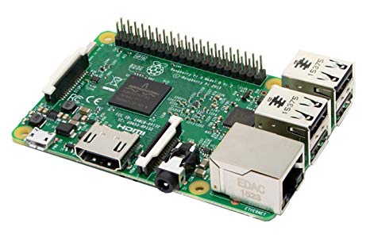

# QR-Reader

## Story

In the room there are three pieces of QR code which are hidden separately that the user will have to find. When he will have collected all the pieces, he will have to superimpose them in several way to find the good one. The QR codes are transparent, so he has a lot of possibility to adjust them in all the directions. To verify if it's the correct adjustment, the user will use his phone with the QR reader everytime he thinks that it's the good one. 

<table>
  <thead>
    <tr>
      <th style="text-align:left"></th>
      <th style="text-align:left"></th>
    </tr>
  </thead>
  <tbody>
    <tr>
      <td style="text-align:left">
        <p></p>
        <p></p>
        <p>
          
        </p>
      </td>
      <td style="text-align:left">
        <p></p>
        <p></p>
        <p>
          
        </p>
      </td>
    </tr>
    <tr>
      <td style="text-align:left">
        <p></p>
        <p>
          
        </p>
      </td>
      <td style="text-align:left">
        <p></p>
        <p>
          
        </p>
      </td>
    </tr>
  </tbody>
</table>## About

The **QR Reader** reads the data that is processed on the basis of the puzzle.

**QR code** \(abbreviated from **Quick Response Code**\) is the trademark for a type of [matrix barcode](https://en.wikipedia.org/wiki/Matrix_barcode) \(or two-dimensional [barcode](https://en.wikipedia.org/wiki/Barcode)\) first designed in 1994 for the [automotive industry in Japan](https://en.wikipedia.org/wiki/Automotive_industry_in_Japan).[\[1\]](https://en.wikipedia.org/wiki/QR_code#cite_note-1) A barcode is a machine-readable optical label that contains information about the item to which it is attached. In practice, QR codes often contain data for a [locator](https://en.wikipedia.org/wiki/URL), identifier, or [tracker](https://en.wikipedia.org/wiki/Website_visitor_tracking) that points to a website or application. A QR code uses four standardized encoding modes \(numeric, alphanumeric, byte/binary, and [kanji](https://en.wikipedia.org/wiki/Kanji)\) to store data efficiently; extensions may also be used.[\[2\]](https://en.wikipedia.org/wiki/QR_code#cite_note-QRCodefeatures-2)


## Materials

### Raspberry Pi 3B

The **Raspberry Pi** is a series of small [single-board computers](https://en.wikipedia.org/wiki/Single-board_computer) developed in the [United Kingdom](https://en.wikipedia.org/wiki/United_Kingdom) by the [Raspberry Pi Foundation](https://en.wikipedia.org/wiki/Raspberry_Pi_Foundation) to promote teaching of basic [computer science](https://en.wikipedia.org/wiki/Computer_science) in schools and in [developing countries](https://en.wikipedia.org/wiki/Developing_countries).The original model became far more popular than anticipated,[\[8\]](https://en.wikipedia.org/wiki/Raspberry_Pi#cite_note-1000x-8) selling outside its [target market](https://en.wikipedia.org/wiki/Target_market) for uses such as [robotics](https://en.wikipedia.org/wiki/Robotics). It does not include peripherals \(such as [keyboards](https://en.wikipedia.org/wiki/Keyboard_%28computing%29) and [mice](https://en.wikipedia.org/wiki/Mouse_%28computing%29)\) and [cases](https://en.wikipedia.org/wiki/Computer_case). However, some accessories have been included in several official and unofficial bundles.[\[8\]](https://en.wikipedia.org/wiki/Raspberry_Pi#cite_note-1000x-8)



The Raspberry Pi 3 Model B+ is the latest product in the Raspberry Pi 3 range.

* Broadcom BCM2837B0, Cortex-A53 \(ARMv8\) 64-bit SoC @ 1.4GHz
* 1GB LPDDR2 SDRAM
* 2.4GHz and 5GHz IEEE 802.11.b/g/n/ac wireless LAN, Bluetooth 4.2, BLE
* Gigabit Ethernet over USB 2.0 \(maximum throughput 300 Mbps\)
* Extended 40-pin GPIO header
* Full-size HDMI
* 4 USB 2.0 ports
* CSI camera port for connecting a Raspberry Pi camera
* DSI display port for connecting a Raspberry Pi touchscreen display
* 4-pole stereo output and composite video port
* Micro SD port for loading your operating system and storing data
* 5V/2.5A DC power input
* Power-over-Ethernet \(PoE\) support \(requires separate PoE HAT\)

### Raspicam

The Raspberry Pi Camera Module v2 replaced the original Camera Module in April 2016. The v2 Camera Module has a Sony IMX219 8-megapixel sensor \(compared to the 5-megapixel OmniVision OV5647 sensor of the original camera\).

The Camera Module can be used to take high-definition video, as well as stills photographs. It’s easy to use for beginners, but has plenty to offer advanced users if you’re looking to expand your knowledge. There are lots of examples online of people using it for time-lapse, slow-motion, and other video cleverness. You can also use the libraries we bundle with the camera to create effects.


### Raspberry pi PoE HAT

The Raspberry Pi Power over Ethernet HAT is a small accessory for the Raspberry Pi computer. It can only be used with the [Raspberry Pi 3 Model B+](https://www.raspberrypi.org/products/raspberry-pi-3-model-b-plus/) \(launched March 2018\). The PoE HAT allows you to power your Raspberry Pi using Power over Ethernet–enabled networks; for this product to be used, the network it is connected to needs to have power-sourcing equipment installed.


The Raspberry Pi PoE HAT is an add-on board for the Raspberry Pi 3 Model B+. It allows the Raspberry Pi to be powered via a power-enabled Ethernet network.

* 802.3af PoE
* Fully isolated switched-mode power supply
* 37–57V DC, Class 2 device
* 5V/2.5A DC output
* 25mm x 25mm brushless fan for processor cooling
* Fan control

## Installation

Clone the repository and follow the REAMDE.MD 

```text
git clone https://github.com/escape-room-samk/qr-scanner.git
```

Run the script with 

```text
sudo python reader.py 0
```


