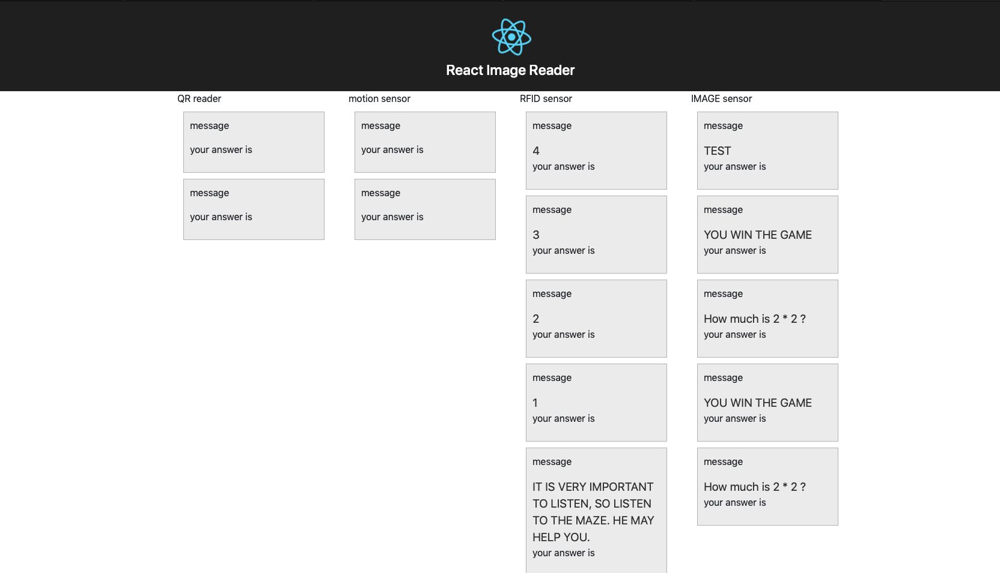

# Frontend

## About

React makes it painless to create interactive UIs. Design simple views for each state in your application, and React will efficiently update and render just the right components when your data changes.

Declarative views make your code more predictable and easier to debug.

## Installation

```text
Git clone https://github.com/escape-room-samk/frontend.git
cd frontend
npm install
npm start
```



